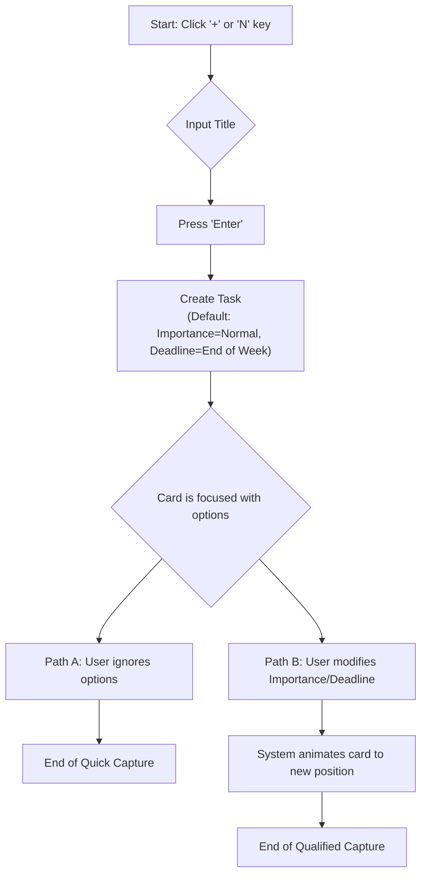
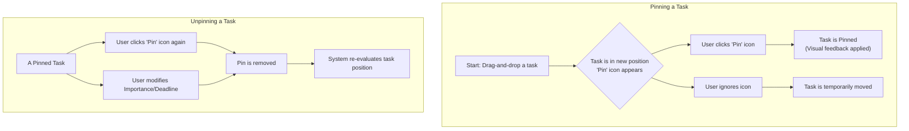

# UX Design Specification training-bmad-method-todolist

**Author:** Jean-Paul
**Date:** 2026-02-24

---

<!-- UX design content will be appended sequentially through collaborative workflow steps -->
## Executive Summary

### Project Vision
The project aims to create a daily execution tool for busy freelancers and team leaders. It provides a "living 5-day plan" that intelligently prioritizes tasks based on their economic value and deadlines. The core of the product is its ability to absorb unplanned work in real-time, recalculating the optimal work sequence and providing a new, credible plan instantly. It acts as a decision-support assistant, always respecting the user's final judgment.

### Target Users
The target users are tech-savvy professionals (freelancers, team leaders) who manage multiple concurrent projects. They are constantly juggling priorities and need to organize their time effectively. They work from various locations (office, home, on the go) and use both desktop and mobile devices, expecting a seamless and consistent experience across all platforms. Their main goal is to reduce the mental load of deciding "what to do next" and to handle unforeseen events without losing control.

### Key Design Challenges
- **Multi-Device Coherence:** Ensuring a fluid experience between a large desktop screen (with complex interactions like drag-and-drop) and a small mobile screen. The mobile experience must offer fast, "zero-friction" alternatives, such as shortcut buttons ("Postpone to earliest", "High Priority"), to compensate for the lack of complex manipulation.
- **Intuitive Prioritization:** Designing an interface that allows for easy reordering of tasks, especially those with the same priority level. The user must be able to visually and simply decide the sequence of their work.
- **Visualizing AI Suggestions:** Clearly and non-intrusively presenting the system's organizational suggestions. The interface must visually distinguish between an AI recommendation and a user's manual override to maintain user sovereignty.

### Design Opportunities
- **The "Living Plan" Visualization:** A key opportunity lies in creating a unique and powerful data visualization that shows the plan adapting in real-time. Seeing tasks shift in response to an interruption can become the application's signature feature.
- **"Zero-Friction" Capture:** Adding a task from a mobile device in a few seconds should be an incredibly fast and simple experience, setting the product apart from heavier tools.
- **Building Trust Through Transparency:** The interface can actively build user trust by showing *why* a reorganization is suggested and making the history of decisions (splits, postponements) easily accessible.
## Core User Experience

### Defining Experience
The core experience is **intuitive and assisted planning**. This is defined by the user's ability to effortlessly rearrange tasks by manipulating their prioritization criteria, and to create new tasks that are intelligently and automatically scheduled. The primary goal is for the user to immediately understand what needs to be done and when.

### Platform Strategy
The product will be a **Progressive Web App (PWA)**, ensuring a consistent and seamless experience on both desktop and mobile web browsers. All interactions will be optimized for mouse/keyboard on desktop and touch on mobile. The application will support **offline capabilities**, allowing users to view their schedule and even create or modify tasks without an internet connection, with changes syncing automatically upon reconnection.

### Effortless Interactions
- **"Zero-Friction" Task Creation:** Adding a new task must be incredibly fast and fluid, especially on mobile.
- **Intelligent Auto-Positioning:** The "wow" moment occurs when a user adds a task, and it automatically slots into the perfect position in the schedule based on existing constraints and priorities.
- **Automatic Re-planning:** The entire schedule should dynamically and automatically adjust based on user inputs (new tasks, status changes, priority shifts) without requiring manual recalculation.
- **Seamless Task Management:** Splitting a task into smaller sub-tasks or changing a task's status should be simple, one-click actions.

### Critical Success Moments
- **The "Aha!" Moment:** The user realizes the product's value when they see the system provide relevant, non-intrusive organizational suggestions that genuinely help them.
- **Feeling of Accomplishment:** Users feel successful when they spend less time organizing and more time executing their tasks, trusting the plan laid out for them.
- **First-Time User Success:** A new user's initial success comes from being able to quickly and easily perform a bulk import or creation of their existing to-do list, getting their workspace set up with minimal friction.
- **Critical Failure Point:** The experience is ruined if any modification to the schedule results in an incoherent or illogical plan. The system's reliability is paramount.

### Experience Principles
- **Instant Clarity:** The user must always know what the most relevant next task is, without cognitive effort.
- **Intelligent, Not Intrusive, Assistance:** The system guides and suggests, but the user always has final control. Trust is built on this sovereignty.
- **Multi-Platform Fluidity:** The experience must be natural and effective, whether on a large screen with a mouse or on a mobile device with quick actions.
- **Zero Friction at Capture:** Adding a new task, whether a quick idea or an unexpected event, must be a simple and immediate action.
## Desired Emotional Response

### Primary Emotional Goals
The primary emotional goal is to make the user feel **in control and confident**. They should feel a sense of mastery over their time, trusting the tool to provide relevant and effective assistance. The core feelings to evoke are **fluidity, efficiency, satisfaction, and relevance**.

### Emotional Journey Mapping
- **First Discovery:** The user should feel intrigued by the promise of intelligent assistance, yet reassured by the simplicity of the interface.
- **Core Experience (Planning):** While organizing their tasks, the user should feel in control, capably assisted, and "listened to" by the system, which respects their manual overrides.
- **Task Completion:** Completing a task should bring a clear sense of accomplishment, encouraging the user to move on to the next item with positive momentum.
- **Returning to the App:** Opening the app should inspire confidence and serenity, as the user is greeted with a clear and reliable plan for their day.

### Micro-Emotions
The most critical micro-emotions to cultivate are:
- **Confidence over Confusion:** The interface must be predictable and clear.
- **Trust over Skepticism:** The system's suggestions and data must be reliable.
- **Enthusiasm over Anxiety:** The experience should be engaging and empowering, not stressful.
- **Satisfaction over Frustration:** The core workflows must be smooth and rewarding.

### Design Implications
- **To Inspire Trust:** The design must be transparent. AI suggestions will be clearly labeled and easy to accept or ignore. The history of each task (why it was moved, what changed) will be easily accessible.
- **To Generate Enthusiasm:** Key moments, like a task automatically finding its perfect spot, will be enhanced with subtle, satisfying micro-animations. The overall speed and responsiveness of the app are crucial.
- **To Ensure Satisfaction:** Marking a task as "complete" will be a gratifying action, reinforced by positive visual feedback (e.g., a pleasing checkmark animation) and the clean archiving of the task.
- **To Foster a Sense of Partnership:** The application's tone will be that of a competent partner. It builds a sense of collaboration by consistently providing relevant assistance and respecting the user's final decisions.

### Emotional Design Principles
- **Clarity Breeds Confidence:** A clear, predictable interface is the foundation of user trust.
- **Empower, Don't Overrule:** The user is the ultimate authority. The system assists, it never dictates.
- **Fluidity Creates Flow:** Every interaction should be smooth and fast, helping the user maintain a state of productive flow.
- **Celebrate Progress:** Acknowledge and reward task completion to create a positive feedback loop.
## UX Pattern Analysis & Inspiration

### Inspiring Products Analysis
- **Trello:** Praised for its clear, simple board view and the satisfying, direct manipulation of tasks via drag-and-drop. Its core strength is the visual representation of workflow through cards and columns. However, its weakness for our purpose is its passive nature; it's a "dumb" board that requires the user to do all the organizational work.
- **Inline Editing (General Pattern):** The ability to edit task details directly within the main board view, without opening a modal window or navigating to a new page, is highly valued. This pattern promotes a fluid, uninterrupted workflow.

### Transferable UX Patterns
- **Navigation & Interaction:**
    - **Time-Based Kanban Board:** We will adapt Trello's classic board. Instead of status columns (To-Do, In Progress), our columns will represent time ("Today," "Tomorrow," etc.) to visualize the "living 5-day plan."
    - **Direct Manipulation via Drag-and-Drop:** This will be the primary method for users to manually override the system's suggestions, providing a strong sense of control.
    - **Inline Editing:** Clicking on a task's title or other key fields will make them directly editable, supporting our "zero-friction" principle.
- **Visual Patterns:**
    - **The "Card" as the Task Unit:** Inspired by Trello, each task will be a self-contained visual card. It will display key information compactly (priority, deadline, subject) for at-a-glance readability.

### Anti-Patterns to Avoid
- **Feature Overload & Required Configuration:** We will actively avoid overwhelming the user with endless custom fields or complex automation rules upfront. The product must deliver value immediately, without a mandatory setup phase.
- **Passive, "Dumb" Boards:** The primary anti-pattern we are designing against is a board that merely stores information. Our board must be an active, intelligent partner in the planning process.

### Design Inspiration Strategy
- **Adopt:** We will adopt the familiar and effective "card" metaphor for tasks, the intuitive "drag-and-drop" for manual reorganization, and "inline editing" for frictionless modifications.
- **Adapt:** We will adapt the Kanban board concept, transforming it from a status-based view to a time-based planning view that aligns with our core "living plan" feature.
- **Avoid:** We will strictly avoid the path of becoming another generic, passive project management tool that requires heavy configuration. Our focus is on intelligent assistance and immediate clarity.
## Design System Foundation

### Design System Choice
We will use **MUI (formerly Material-UI)** as the foundational design system for this project.

### Rationale for Selection
- **Development Speed:** MUI provides a comprehensive library of ready-to-use React components, which will significantly accelerate the construction of our UI, including complex elements like dialogs, menus, and drag-and-drop interactions.
- **Reliability and Accessibility:** By leveraging a popular and well-maintained system, we inherit components that adhere to accessibility standards and have been battle-tested across millions of users.
- **Balance of Familiarity and Customization:** We start with the principles of Material Design, which are familiar to many users, reducing the learning curve. Simultaneously, MUI's powerful theming system allows us to create a unique visual identity that aligns with our brand goals of trust, clarity, and efficiency, rather than looking like a generic Google application.

### Implementation Approach
- We will use MUI components for all basic UI elements (buttons, text fields, cards, etc.).
- For application-specific layouts, such as our main time-based board, we will compose and style MUI components to build this unique view.

### Customization Strategy
- We will define a central theme for the application. This includes a custom color palette, typography, and border styles to move away from the default Material Design look and feel. The goal is to craft a visual identity that is clean, professional, and reinforces the desired emotional response of confidence and control.
## Defining Core Interaction

### Defining Experience
The defining experience, the promise to the user, is: **"Adopt cruise speed, use your precious time effectively."** This translates into the core interaction: **"Add a task and watch your plan adapt intelligently."** This is the "magical" moment where the tool works for the user, transforming a manual chore into an assisted, satisfying experience.

### User Mental Model
Users are familiar with Kanban-style tools like Trello. They appreciate the visual clarity of cards and columns and the direct control of drag-and-drop. However, they are frustrated by the constant manual effort required to keep these boards organized, especially when priorities change. They expect a board-like interface but hope for an intelligent assistant to help them order the chaos, not just store it.

### Success Criteria
The success of the core experience hinges on three pillars:
- **Relevance:** The automatic reorganization of the plan must be logical and align with the user's goals.
- **Instantaneity:** The re-planning must feel immediate (< 2 seconds), as fast as the user's own thought process.
- **Transparency:** The user must intuitively understand *why* the plan changed. This is achieved through fluid animations that show cards moving to their new positions, rather than the page just reloading.

### Novel UX Patterns
Our core experience is an **innovative combination of established patterns**.
- **Established Patterns:** We leverage the familiarity of the Kanban board, task cards, and drag-and-drop manipulation.
- **The Novelty (Our "Twist"):** The "living, self-organizing board." Unlike a passive Trello board, our board actively assists the user. We will "teach" this new behavior through design:
    - **Fluid Animations:** When a task is added, the movement of other cards visually communicates that the system is working for the user.
    - **Visual Cues for Overrides:** When a user manually drags a card to a specific spot, we will use a visual indicator (e.g., a "pin" icon) to signify that this position is now "locked" and will be respected by the auto-organizer. This builds trust and reinforces user control.

### Experience Mechanics
The step-by-step flow for our defining experience is as follows:
1.  **Initiation:** The user clicks a prominent "+" button to add a new task.
2.  **Interaction:** A simple form appears. The user provides:
    - A **Title**.
    - **Importance** (e.g., High, Normal, Low).
    - **Temporality** (e.g., ASAP, Tomorrow, End of Week).
    The system then combines Importance and Temporality to calculate an internal priority score. For quick capture, default values are used if only a title is provided.
3.  **Feedback (The "Magic"):** The new task card appears, and simultaneously, any other affected cards animate smoothly to their new, correctly prioritized positions in the plan.
4.  **Completion:** The animation concludes, the board is stable, and the user sees their updated, coherent plan, ready for the next action. They have successfully captured a task and delegated the mental load of re-planning to the tool.
## Visual Foundation

### 1. Color Palette
The visual identity is built upon the French Government Design System (DSFR), ensuring consistency, accessibility, and a sense of trust. The application will support both light and dark themes.

#### Light Theme
- **Primary:** `#000091` (Bleu France) - Used for primary actions, buttons, and interactive elements.
- **Secondary:** `#B7A73F` (Green Tilleul Verveine) - Used for accents and secondary information.
- **Error:** `#CE0500` - For error messages and destructive actions.
- **Warning:** `#B34000` - For warnings and non-critical alerts.
- **Success:** `#18753C` - For success confirmations.
- **Background:** `#F6F6F6` - The main application background color.
- **Surface:** `#FFFFFF` - For elevated surfaces like cards and modals.

#### Dark Theme
- **Primary:** `#8585F6` - A lighter, vibrant blue for readability on dark backgrounds.
- **Secondary:** `#B7A73F` - The accent green remains effective in dark mode.
- **Error:** `#FF5655` - A brighter red for high visibility.
- **Warning:** `#FC5D00`
- **Success:** `#27A658`
- **Background:** `#161616` - The main application background color.
- **Surface:** `#242424` - For elevated surfaces like cards and modals.

### 2. Typography System
The typographic system is designed to be both elegant and highly readable, reinforcing the application's professional and trustworthy character.

- **Headings Font:** **Spectral (Extra-Bold)** will be used for all headings (H1, H2, etc.). Its serif nature provides a strong visual anchor and establishes a clear hierarchy.
- **Body & UI Font:** **Marianne (Regular, Bold)** will be used for all body text, paragraphs, button labels, and other interface elements. Its sans-serif design ensures excellent legibility at all sizes.
- **Fallback Fonts:** `Arial` will serve as the fallback for `Marianne`, and `Georgia` for `Spectral`, ensuring a consistent experience on systems where the primary fonts are not available.

### 3. Spacing & Layout
The layout will be **structured and efficient**, designed to present information clearly without feeling cluttered.

- **Base Unit:** The spacing system is based on a **4px grid**. All margins, paddings, and component dimensions will be multiples of 4px (e.g., 4, 8, 12, 16, 24, 32px) to create a consistent vertical and horizontal rhythm.
- **Fine-tuning:** Specific micro-adjustments (e.g., 2px, 6px) will be used where necessary for precise optical alignment of text and icons.
- **Vertical Rhythm:** A consistent vertical margin of **24px (1.5rem)** will be applied between major text blocks (titles and paragraphs) to ensure comfortable readability.
## Design Directions

Based on our exploration, we will adopt the **"Hyper-Efficient"** design direction as the primary visual and interaction model for the application. This direction is tailored for power users who prioritize speed, information density, and productivity.

### Core Principles of "Hyper-Efficient"

*   **Layout & Spacing: High Density**
    *   The interface will utilize a tight 4px grid system to maximize the amount of information visible on screen, reducing the need for scrolling.
    *   Margins and paddings will be minimal (e.g., 4px, 8px) to create a dense, dashboard-like feel.
    *   White space is employed functionally to delineate groups of information, rather than for purely aesthetic purposes.

*   **Visual Style: Sharp & Clean**
    *   The aesthetic is clean and flat, using fine lines for borders and dividers.
    *   Shadows and gradients will be used sparingly, if at all, to avoid visual clutter.
    *   Color is a tool for conveying information. It will be used purposefully to indicate status, priority, and interactivity, with the primary palette being neutral greys complemented by our defined semantic colors.

*   **Animation & Interaction: Instantaneous Feedback**
    *   Animations are minimal, subtle, and fast (<150ms) to ensure the interface feels responsive and immediate.
    *   The core re-planning animation will be a swift and direct repositioning of task cards, reinforcing the sense of efficiency.
    *   The design will be optimized for keyboard-first interactions, with clear shortcuts for all primary actions.
## User Journey Flows

This section details the step-by-step interaction flows for the most critical user tasks, translating user stories into concrete application behavior.

### Journey 1: "Zero-Friction" Task Capture
**Objective:** To allow a user to capture a new task as quickly as possible, without interrupting their train of thought, while encouraging subsequent qualification.

**Interaction Flow:**
1.  **Trigger:** The user clicks the global `+` button or uses a keyboard shortcut (`N`).
2.  **Quick Input:** A text input field appears. The user types the task title and presses `Enter`.
3.  **Instant Creation:** A new task card is created with default attributes: `Importance: Normal` and `Deadline: End of Week`.
4.  **Optional Qualification:** The new card remains in a focused state, displaying controls (dropdowns) to modify `Importance` and `Deadline`. The `Deadline` dropdown includes options like `Today`, `Tomorrow`, `End of Week`, `Next Week`, and `Specific Date...` (which opens a calendar limited to future dates).
5.  **Bifurcation:**
    *   **Path A (Capture Complete):** The user takes no further action. The card is placed in the "End of Week" column. The journey is complete.
    *   **Path B (Qualification):** The user modifies the `Importance` and/or `Deadline`.
6.  **Intelligent Reorganization:** Upon modification, the system recalculates the task's priority and animates the card smoothly to its new optimal position in the plan.

**Flow Diagram:**


### Journey 2: Daily Triage & Re-planning
**Objective:** At the start of the day, the user reviews their plan, handles overdue tasks, and confidently prepares for the day ahead.

**Interaction Flow:**
1.  **Trigger:** The user opens the application.
2.  **Overdue Detection:** The system identifies any uncompleted tasks from previous days.
3.  **Active Notification:** If overdue tasks exist, a notification appears: "You have X overdue tasks." It offers global actions: `Re-plan All for Me` and `Manage Manually`.
4.  **Flexible Handling:** The user has multiple options:
    *   **Global Auto-Replan:** Clicking `Re-plan All for Me` lets the system intelligently reschedule all overdue tasks.
    *   **Manual Triage:** The user can address each overdue task individually. On each overdue card, they can:
        *   **Drag-and-drop** it to a new position.
        *   Click a **"Re-plan this task"** icon to have the system find the best new spot for it.
        *   Change its status to `Cancelled` (prompting for a comment) or `Delete`.
5.  **Daily Plan Adjustment:** The user fine-tunes the current day's plan by either modifying task attributes (letting the system re-sort) or by dragging-and-dropping tasks to manually set their order.

**Flow Diagram:**
```mermaid
graph TD
    A[Start: Open App] --> B{Detect Overdue Tasks};
    B -- Yes --> C[Notification: "X tasks overdue"];
    B -- No --> K[Plan is Up-to-Date];
    C --> D["Global Action: Re-plan All"];
    C --> E["Global Action: Manage Manually"];
    D --> F[System re-plans all overdue tasks];
    F --> K;
    E --> G{Triage each overdue task};
    G --> H("Drag & Drop");
    G --> I("Click 'Re-plan Task' Icon");
    G --> J("Change Status: Cancel/Delete");
    H & I & J --> K;
    K --> L{Adjust Today's Plan};
    L --> M[End: Plan is Ready];
```

### Journey 3: Manual Override & Pinning
**Objective:** To allow the user to override the system's logic by "pinning" a task to a specific position, ensuring their manual choice is respected.

**Interaction Flow:**
1.  **Trigger:** The user decides a task is not in the right place.
2.  **Action:** They drag-and-drop the task to their desired position.
3.  **Pinning Proposal:** Upon release, an inactive "pin" icon appears on the card.
4.  **User Decision:**
    *   **Pinning:** The user clicks the "pin" icon. It becomes active, and the card's border changes color to provide strong visual feedback. The task is now locked.
    *   **No Pinning:** The user ignores the icon. The task remains in the new position but is not locked and can be moved by future auto-reorganizations.
5.  **Breaking the Pin:** A pin is automatically "broken" and removed if the user modifies the `Importance` or `Deadline` of the pinned task. The system then re-evaluates its position.
6.  **Manual Unpinning:** The user can click the active pin icon at any time to release the task back to the system's control.

**Flow Diagram:**

## Component Strategy
This section defines the strategy for implementing the user interface, distinguishing between standard components from the chosen design system (MUI) and custom components required to deliver the application's unique experience.

### 1. Design System Coverage
- **Foundation:** We will leverage the rich component library provided by **MUI** for all standard UI elements, ensuring development speed, reliability, and accessibility.
- **Core Components Used:** `Button`, `IconButton`, `TextField`, `Select`, `Menu`, `Paper`, `Grid`, `Typography`, `Tooltip`.

### 2. Custom Components
To realize the "Hyper-Efficient" design direction and our specific user journeys, three key custom components will be developed.

#### 2.1. `TaskCard`
This is the atomic unit of the application, representing a single task.

- **Purpose:** To display essential task information at a glance and provide rapid interaction capabilities.
- **Anatomy (Default State):**
    - **Title:** Always visible.
    - **Importance:** Represented by a colored icon.
    - **Deadline:** Displayed as clear text (e.g., "Tomorrow", "Feb 28").
    - **Pin Icon:** Always visible, toggling the pinned state.
- **Visual States:**
    - **Default:** Standard appearance.
    - **Hover:** The card scales up slightly (`scale: 1.03`) and reveals action buttons.
    - **Dragging:** The card becomes semi-transparent.
    - **Overdue:** A prominent "Overdue" badge is displayed.
    - **Pinned:** The pin icon is active, and the left border of the card is highlighted with the primary color.
- **Actions:**
    - **On-Click:** Activates "inline editing" mode for the title and other fields.
    - **Hover Buttons:** `Edit`, `Re-plan Task`, `Delete`.

#### 2.2. `TimeBasedKanbanBoard`
This is the main stage for the application, organizing tasks into a timeline.

- **Purpose:** To provide a clear, time-based view of the user's plan and manage drag-and-drop interactions.
- **Anatomy:**
    - **Columns:** "Today", "Tomorrow", "End of Week", etc.
    - **Column Headers:** Clear titles with task counters.
    - **Drag-and-Drop Context:** The entire board serves as a drop zone for `TaskCard` components.

#### 2.3. `OverdueTaskNotification`
A dedicated component to handle overdue tasks gracefully.

- **Purpose:** To inform the user of overdue tasks and provide clear, immediate actions.
- **Anatomy:**
    - A non-intrusive notification bar.
    - **Content:** "You have X overdue tasks."
    - **Actions:** `Re-plan All for Me` and `Manage Manually`.
## UX Consistency Patterns

### 1. Button Hierarchy and Actions
The goal is to create a clear visual hierarchy to instantly guide the user to the most important action.

- **Primary Button (Contained):**
    - **When to Use:** For the most important, final action of a view or form (e.g., "Save", "Create Task"). Only one should be visible at a time.
    - **Style:** Solid background with the `primary` color (`#000091`) for strong visual presence.

- **Secondary Button (Outlined):**
    - **When to Use:** For alternative, non-destructive actions (e.g., "Cancel" in a form, "Advanced Options").
    - **Style:** `primary` color border (`#000091`) on a transparent background. Less prominent than the primary button.

- **Tertiary/Text Button (Text):**
    - **When to Use:** For less important or contextual actions that should not distract (e.g., "Learn More", "Reset Filter").
    - **Style:** Just text colored in `primary` (`#000091`), with no background or border.

- **Floating Action Button (FAB):**
    - **When to Use:** Exclusively for the main creation action: the `+` for "Add Task". It is persistent and always accessible.
    - **Style:** A circle with the `secondary` color (`#B7A73F`) for a distinctive contrast, with a `+` icon inside.

- **Icon Button (IconButton):**
    - **When to Use:** For repetitive, contextual actions directly on task cards (e.g., Edit, Pin, Delete). Enables a dense and efficient interface.
    - **Style:** A simple icon. The color changes on hover to indicate interactivity.

### 2. Feedback Patterns
The goal is to provide clear, contextual, and appropriate feedback without being intrusive.

- **Success Feedback (Action Succeeded):**
    - **When to Use:** To confirm a successful action that requires no further validation (e.g., "Task created", "Plan reorganized").
    - **Pattern:** Use a **Snackbar** component (MUI) at the bottom of the screen. It appears briefly (3-4 seconds) then disappears automatically.
    - **Style:** `success` color background (`#18753C`) with a concise message.

- **Error Feedback (Action Failed):**
    - **Form Validation:** The error is displayed directly below the relevant field, in `error` color (`#CE0500`). The field's border also turns red. This is immediate and does not block the rest of the form.
    - **Critical System Error:** If a major action fails (e.g., unable to save data), display a prominent, non-dismissible **Alert** (MUI) at the top of the page, explaining the problem and the next steps.

- **Warning Feedback (Attention Required):**
    - **When to Use:** To inform about a situation that is not an error but has consequences (e.g., "Offline mode is active. Your changes will be synced later.").
    - **Pattern:** Use an **Alert** (MUI) with the `warning` color (`#B34000`). It can be dismissed by the user.

- **Informational Feedback (Tip or Info):**
    - **When to Use:** To provide non-critical tips or information.
    - **Pattern:** Use a discreet **Alert** (MUI) with the `secondary` color (`#B7A73F`), which can be easily closed.

### 3. Form and Validation Patterns
The goal is to make data entry as smooth as possible by guiding the user and providing clear, immediate validation.

- **Field Appearance:**
    - **Style:** We will use the **"Outlined"** variant of MUI's `TextField`. It's a modern, clear style that fits our "Sharp & Clean" design.
    - **Label:** The field label will be positioned inside the field by default and will move above it upon entry (standard MUI behavior).

- **Data Validation:**
    - **Real-time Validation (Inline):** Validation occurs when the user leaves a field (`onBlur`), not while they are typing.
    - **Error Display:**
        - A concise help message appears directly below the field, in `error` color (`#CE0500`).
        - The field's border also turns red.
    - **"Save" Button Disabling:** The form's main submission button is `disabled` until all required fields are valid. This prevents erroneous submissions.

- **Specific Case: Inline Editing on `TaskCard`**
    - **Trigger:** A click on a `TaskCard`'s title transforms the text into a `TextField`.
    - **Save:** Saving is implicit. It occurs either by pressing `Enter` or by clicking outside the field (`onBlur`).
    - **Cancel:** Pressing the `Escape` key cancels the edit and restores the original title.

### 4. Empty and Loading States
The goal is to guide the user and manage their expectations when content is not yet available.

- **Initial Loading State:**
    - **When to Use:** On the very first application load, when initial data is being fetched.
    - **Pattern:** Display a "skeleton" version (`Skeleton` from MUI) of the main interface. The user will see animated gray shapes mimicking the structure of the `TimeBasedKanbanBoard` and a few `TaskCard`s.

- **Action Loading State:**
    - **When to Use:** When a user action triggers a background operation (e.g., re-planning the board).
    - **Pattern:** For quick actions, a simple `CircularProgress` indicator (MUI) can be shown on the button that triggered the action. In our main case (reorganization), the animation of the cards moving *is* the loading indicator.

- **Empty State (First Use):**
    - **When to Use:** When the user's board is completely empty (right after sign-up).
    - **Pattern:** Display a centered welcome message, a brief suggestion for the first action, and highlight the main add button (`+`).
    - **Message:** "Welcome! Ready to organize your day? Click `+` to create your first task."

- **Empty State (Search or Filter with No Results):**
    - **When to Use:** When a user applies a filter or performs a search that returns no results.
    - **Pattern:** Display a clear and helpful message in the center of the content area.
    - **Message:** "No tasks match your search. Try adjusting your filters." Provide a button to "Reset Filters".
## Responsive & Accessibility Strategy

### 1. Responsive Design Strategy
The goal is to ensure a fluid and consistent experience across all devices by adapting the interface to the constraints of each screen size.

- **Mobile Strategy (< 768px):**
    - **Layout:** The Kanban view is preserved with horizontally scrolling columns. This maintains the "5-day plan" mental model.
    - **Interaction:** Drag-and-drop is **disabled** for usability reasons. Moving a task between columns is done by editing its `Deadline` field directly on the card.

- **Tablet Strategy (768px to 1023px):**
    - **Layout:** The multi-column Kanban view is fully displayed, taking advantage of the extra space.
    - **Interaction:** The interface is optimized for touch with slightly larger spacing and click targets. Drag-and-drop is fully functional.

- **Desktop Strategy (> 1024px):**
    - **Layout:** This is the reference view, displaying the maximum amount of information with high density. All plan columns are visible without horizontal scrolling.

### 2. Breakpoint Strategy
We will use the standard, proven breakpoints from MUI, which cover the vast majority of devices:
- **xs (mobile):** < 600px
- **sm (mobile/small tablet):** 600px - 900px
- **md (tablet):** 900px - 1200px
- **lg (desktop):** > 1200px

Our "mobile" design will apply to the `xs` and `sm` breakpoints, "tablet" to `md`, and "desktop" to `lg`.

### 3. Accessibility (A11y) Strategy
The goal is to make the application usable by everyone, including people using assistive technologies (screen readers, etc.).

- **Compliance Level:** We will target **WCAG 2.1 Level AA** compliance. This is the industry standard for web applications, ensuring a high level of accessibility.
- **Concrete Actions:**
    - **Color Contrast:** Our chosen colors meet the AA level contrast ratios.
    - **Keyboard Navigation:** All interactions (creating, editing, pinning a task) must be fully achievable with a keyboard.
    - **ARIA Labels:** We will add descriptive labels for screen readers, especially for `IconButton`s and other non-textual interactive elements.
    - **Focus Management:** The tab order will be logical, and the focus will be clearly visible.
---
# UX Design Specification training-bmad-method-todolist

**Author:** Jean-Paul
**Date:** 2026-02-24

---

<!-- UX design content will be appended sequentially through collaborative workflow steps -->
## Executive Summary

### Project Vision
The project aims to create a daily execution tool for busy freelancers and team leaders. It provides a "living 5-day plan" that intelligently prioritizes tasks based on their economic value and deadlines. The core of the product is its ability to absorb unplanned work in real-time, recalculating the optimal work sequence and providing a new, credible plan instantly. It acts as a decision-support assistant, always respecting the user's final judgment.

### Target Users
The target users are tech-savvy professionals (freelancers, team leaders) who manage multiple concurrent projects. They are constantly juggling priorities and need to organize their time effectively. They work from various locations (office, home, on the go) and use both desktop and mobile devices, expecting a seamless and consistent experience across all platforms. Their main goal is to reduce the mental load of deciding "what to do next" and to handle unforeseen events without losing control.

### Key Design Challenges
- **Multi-Device Coherence:** Ensuring a fluid experience between a large desktop screen (with complex interactions like drag-and-drop) and a small mobile screen. The mobile experience must offer fast, "zero-friction" alternatives, such as shortcut buttons ("Postpone to earliest", "High Priority"), to compensate for the lack of complex manipulation.
- **Intuitive Prioritization:** Designing an interface that allows for easy reordering of tasks, especially those with the same priority level. The user must be able to visually and simply decide the sequence of their work.
- **Visualizing AI Suggestions:** Clearly and non-intrusively presenting the system's organizational suggestions. The interface must visually distinguish between an AI recommendation and a user's manual override to maintain user sovereignty.

### Design Opportunities
- **The "Living Plan" Visualization:** A key opportunity lies in creating a unique and powerful data visualization that shows the plan adapting in real-time. Seeing tasks shift in response to an interruption can become the application's signature feature.
- **"Zero-Friction" Capture:** Adding a task from a mobile device in a few seconds should be an incredibly fast and simple experience, setting the product apart from heavier tools.
- **Building Trust Through Transparency:** The interface can actively build user trust by showing *why* a reorganization is suggested and making the history of decisions (splits, postponements) easily accessible.
## Core User Experience

### Defining Experience
The core experience is **intuitive and assisted planning**. This is defined by the user's ability to effortlessly rearrange tasks by manipulating their prioritization criteria, and to create new tasks that are intelligently and automatically scheduled. The primary goal is for the user to immediately understand what needs to be done and when.

### Platform Strategy
The product will be a **Progressive Web App (PWA)**, ensuring a consistent and seamless experience on both desktop and mobile web browsers. All interactions will be optimized for mouse/keyboard on desktop and touch on mobile. The application will support **offline capabilities**, allowing users to view their schedule and even create or modify tasks without an internet connection, with changes syncing automatically upon reconnection.

### Effortless Interactions
- **"Zero-Friction" Task Creation:** Adding a new task must be incredibly fast and fluid, especially on mobile.
- **Intelligent Auto-Positioning:** The "wow" moment occurs when a user adds a task, and it automatically slots into the perfect position in the schedule based on existing constraints and priorities.
- **Automatic Re-planning:** The entire schedule should dynamically and automatically adjust based on user inputs (new tasks, status changes, priority shifts) without requiring manual recalculation.
- **Seamless Task Management:** Splitting a task into smaller sub-tasks or changing a task's status should be simple, one-click actions.

### Critical Success Moments
- **The "Aha!" Moment:** The user realizes the product's value when they see the system provide relevant, non-intrusive organizational suggestions that genuinely help them.
- **Feeling of Accomplishment:** Users feel successful when they spend less time organizing and more time executing their tasks, trusting the plan laid out for them.
- **First-Time User Success:** A new user's initial success comes from being able to quickly and easily perform a bulk import or creation of their existing to-do list, getting their workspace set up with minimal friction.
- **Critical Failure Point:** The experience is ruined if any modification to the schedule results in an incoherent or illogical plan. The system's reliability is paramount.

### Experience Principles
- **Instant Clarity:** The user must always know what the most relevant next task is, without cognitive effort.
- **Intelligent, Not Intrusive, Assistance:** The system guides and suggests, but the user always has final control. Trust is built on this sovereignty.
- **Multi-Platform Fluidity:** The experience must be natural and effective, whether on a large screen with a mouse or on a mobile device with quick actions.
- **Zero Friction at Capture:** Adding a new task, whether a quick idea or an unexpected event, must be a simple and immediate action.
## Desired Emotional Response

### Primary Emotional Goals
The primary emotional goal is to make the user feel **in control and confident**. They should feel a sense of mastery over their time, trusting the tool to provide relevant and effective assistance. The core feelings to evoke are **fluidity, efficiency, satisfaction, and relevance**.

### Emotional Journey Mapping
- **First Discovery:** The user should feel intrigued by the promise of intelligent assistance, yet reassured by the simplicity of the interface.
- **Core Experience (Planning):** While organizing their tasks, the user should feel in control, capably assisted, and "listened to" by the system, which respects their manual overrides.
- **Task Completion:** Completing a task should bring a clear sense of accomplishment, encouraging the user to move on to the next item with positive momentum.
- **Returning to the App:** Opening the app should inspire confidence and serenity, as the user is greeted with a clear and reliable plan for their day.

### Micro-Emotions
The most critical micro-emotions to cultivate are:
- **Confidence over Confusion:** The interface must be predictable and clear.
- **Trust over Skepticism:** The system's suggestions and data must be reliable.
- **Enthusiasm over Anxiety:** The experience should be engaging and empowering, not stressful.
- **Satisfaction over Frustration:** The core workflows must be smooth and rewarding.

### Design Implications
- **To Inspire Trust:** The design must be transparent. AI suggestions will be clearly labeled and easy to accept or ignore. The history of each task (why it was moved, what changed) will be easily accessible.
- **To Generate Enthusiasm:** Key moments, like a task automatically finding its perfect spot, will be enhanced with subtle, satisfying micro-animations. The overall speed and responsiveness of the app are crucial.
- **To Ensure Satisfaction:** Marking a task as "complete" will be a gratifying action, reinforced by positive visual feedback (e.g., a pleasing checkmark animation) and the clean archiving of the task.
- **To Foster a Sense of Partnership:** The application's tone will be that of a competent partner. It builds a sense of collaboration by consistently providing relevant assistance and respecting the user's final decisions.

### Emotional Design Principles
- **Clarity Breeds Confidence:** A clear, predictable interface is the foundation of user trust.
- **Empower, Don't Overrule:** The user is the ultimate authority. The system assists, it never dictates.
- **Fluidity Creates Flow:** Every interaction should be smooth and fast, helping the user maintain a state of productive flow.
- **Celebrate Progress:** Acknowledge and reward task completion to create a positive feedback loop.
## UX Pattern Analysis & Inspiration

### Inspiring Products Analysis
- **Trello:** Praised for its clear, simple board view and the satisfying, direct manipulation of tasks via drag-and-drop. Its core strength is the visual representation of workflow through cards and columns. However, its weakness for our purpose is its passive nature; it's a "dumb" board that requires the user to do all the organizational work.
- **Inline Editing (General Pattern):** The ability to edit task details directly within the main board view, without opening a modal window or navigating to a new page, is highly valued. This pattern promotes a fluid, uninterrupted workflow.

### Transferable UX Patterns
- **Navigation & Interaction:**
    - **Time-Based Kanban Board:** We will adapt Trello's classic board. Instead of status columns (To-Do, In Progress), our columns will represent time ("Today," "Tomorrow," etc.) to visualize the "living 5-day plan."
    - **Direct Manipulation via Drag-and-Drop:** This will be the primary method for users to manually override the system's suggestions, providing a strong sense of control.
    - **Inline Editing:** Clicking on a task's title or other key fields will make them directly editable, supporting our "zero-friction" principle.
- **Visual Patterns:**
    - **The "Card" as the Task Unit:** Inspired by Trello, each task will be a self-contained visual card. It will display key information compactly (priority, deadline, subject) for at-a-glance readability.

### Anti-Patterns to Avoid
- **Feature Overload & Required Configuration:** We will actively avoid overwhelming the user with endless custom fields or complex automation rules upfront. The product must deliver value immediately, without a mandatory setup phase.
- **Passive, "Dumb" Boards:** The primary anti-pattern we are designing against is a board that merely stores information. Our board must be an active, intelligent partner in the planning process.

### Design Inspiration Strategy
- **Adopt:** We will adopt the familiar and effective "card" metaphor for tasks, the intuitive "drag-and-drop" for manual reorganization, and "inline editing" for frictionless modifications.
- **Adapt:** We will adapt the Kanban board concept, transforming it from a status-based view to a time-based planning view that aligns with our core "living plan" feature.
- **Avoid:** We will strictly avoid the path of becoming another generic, passive project management tool that requires heavy configuration. Our focus is on intelligent assistance and immediate clarity.
## Design System Foundation

### Design System Choice
We will use **MUI (formerly Material-UI)** as the foundational design system for this project.

### Rationale for Selection
- **Development Speed:** MUI provides a comprehensive library of ready-to-use React components, which will significantly accelerate the construction of our UI, including complex elements like dialogs, menus, and drag-and-drop interactions.
- **Reliability and Accessibility:** By leveraging a popular and well-maintained system, we inherit components that adhere to accessibility standards and have been battle-tested across millions of users.
- **Balance of Familiarity and Customization:** We start with the principles of Material Design, which are familiar to many users, reducing the learning curve. Simultaneously, MUI's powerful theming system allows us to create a unique visual identity that aligns with our brand goals of trust, clarity, and efficiency, rather than looking like a generic Google application.

### Implementation Approach
- We will use MUI components for all basic UI elements (buttons, text fields, cards, etc.).
- For application-specific layouts, such as our main time-based board, we will compose and style MUI components to build this unique view.

### Customization Strategy
- We will define a central theme for the application. This includes a custom color palette, typography, and border styles to move away from the default Material Design look and feel. The goal is to craft a visual identity that is clean, professional, and reinforces the desired emotional response of confidence and control.
## Defining Core Interaction

### Defining Experience
The defining experience, the promise to the user, is: **"Adopt cruise speed, use your precious time effectively."** This translates into the core interaction: **"Add a task and watch your plan adapt intelligently."** This is the "magical" moment where the tool works for the user, transforming a manual chore into an assisted, satisfying experience.

### User Mental Model
Users are familiar with Kanban-style tools like Trello. They appreciate the visual clarity of cards and columns and the direct control of drag-and-drop. However, they are frustrated by the constant manual effort required to keep these boards organized, especially when priorities change. They expect a board-like interface but hope for an intelligent assistant to help them order the chaos, not just store it.

### Success Criteria
The success of the core experience hinges on three pillars:
- **Relevance:** The automatic reorganization of the plan must be logical and align with the user's goals.
- **Instantaneity:** The re-planning must feel immediate (< 2 seconds), as fast as the user's own thought process.
- **Transparency:** The user must intuitively understand *why* the plan changed. This is achieved through fluid animations that show cards moving to their new positions, rather than the page just reloading.

### Novel UX Patterns
Our core experience is an **innovative combination of established patterns**.
- **Established Patterns:** We leverage the familiarity of the Kanban board, task cards, and drag-and-drop manipulation.
- **The Novelty (Our "Twist"):** The "living, self-organizing board." Unlike a passive Trello board, our board actively assists the user. We will "teach" this new behavior through design:
    - **Fluid Animations:** When a task is added, the movement of other cards visually communicates that the system is working for the user.
    - **Visual Cues for Overrides:** When a user manually drags a card to a specific spot, we will use a visual indicator (e.g., a small "pin" icon) to signify that this position is now "locked" and will be respected by the auto-organizer. This builds trust and reinforces user control.

### Experience Mechanics
The step-by-step flow for our defining experience is as follows:
1.  **Initiation:** The user clicks a prominent "+" button to add a new task.
2.  **Interaction:** A simple form appears. The user provides:
    - A **Title**.
    - **Importance** (e.g., High, Normal, Low).
    - **Temporality** (e.g., ASAP, Tomorrow, End of Week).
    The system then combines Importance and Temporality to calculate an internal priority score. For quick capture, default values are used if only a title is provided.
3.  **Feedback (The "Magic"):** The new task card appears, and simultaneously, any other affected cards animate smoothly to their new, correctly prioritized positions in the plan.
4.  **Completion:** The animation concludes, the board is stable, and the user sees their updated, coherent plan, ready for the next action. They have successfully captured a task and delegated the mental load of re-planning to the tool.
---

# UX Design Specification training-bmad-method-todolist

**Author:** Jean-Paul
**Date:** 2026-02-24

---

<!-- UX design content will be appended sequentially through collaborative workflow steps -->
## Executive Summary

### Project Vision
The project aims to create a daily execution tool for busy freelancers and team leaders. It provides a "living 5-day plan" that intelligently prioritizes tasks based on their economic value and deadlines. The core of the product is its ability to absorb unplanned work in real-time, recalculating the optimal work sequence and providing a new, credible plan instantly. It acts as a decision-support assistant, always respecting the user's final judgment.

### Target Users
The target users are tech-savvy professionals (freelancers, team leaders) who manage multiple concurrent projects. They are constantly juggling priorities and need to organize their time effectively. They work from various locations (office, home, on the go) and use both desktop and mobile devices, expecting a seamless and consistent experience across all platforms. Their main goal is to reduce the mental load of deciding "what to do next" and to handle unforeseen events without losing control.

### Key Design Challenges
- **Multi-Device Coherence:** Ensuring a fluid experience between a large desktop screen (with complex interactions like drag-and-drop) and a small mobile screen. The mobile experience must offer fast, "zero-friction" alternatives, such as shortcut buttons ("Postpone to earliest", "High Priority"), to compensate for the lack of complex manipulation.
- **Intuitive Prioritization:** Designing an interface that allows for easy reordering of tasks, especially those with the same priority level. The user must be able to visually and simply decide the sequence of their work.
- **Visualizing AI Suggestions:** Clearly and non-intrusively presenting the system's organizational suggestions. The interface must visually distinguish between an AI recommendation and a user's manual override to maintain user sovereignty.

### Design Opportunities
- **The "Living Plan" Visualization:** A key opportunity lies in creating a unique and powerful data visualization that shows the plan adapting in real-time. Seeing tasks shift in response to an interruption can become the application's signature feature.
- **"Zero-Friction" Capture:** Adding a task from a mobile device in a few seconds should be an incredibly fast and simple experience, setting the product apart from heavier tools.
- **Building Trust Through Transparency:** The interface can actively build user trust by showing *why* a reorganization is suggested and making the history of decisions (splits, postponements) easily accessible.
